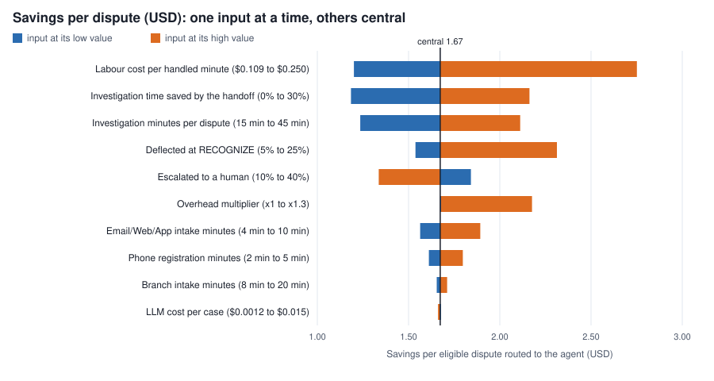

# ROI: cost per dispute today vs. with the agent

Generated by `uv run poe analysis` (Task 16). Aggregates only: counts, rates and quantiles, never row-level data. Every table names the query that produced it (`data_pipeline/dbt/analyses/`), run on the warehouse of this snapshot:

- bronze manifest sha256 `976a3493cd6f628cae0930aa86071280e1cc7802f94485a9827c31138c5e3974`
- silver built at 2026-09-30T02:39:47+00:00 (`data_mode=curated`)
- span: 1,097 days of process dates
- assumptions: `config/roi_assumptions.yaml` (version 1, as of 2026-09-30); LLM prices: `config/pricing.yaml`
- evaluation inputs: provisional (`pending_eval`); the final evaluation (T27) has not run

**Provenance labels.** `measured`: offline measurement on the organizer data. `market`: public LATAM salary, labour-law and FX data. `industry`: published dispute-operations studies (US/EU; no public LATAM figures were found). `team`: team estimate. `pending_eval`: provisional until the final evaluation (T27) measures it. `offline_eval`: measured by the evaluation harness on the held-out case mix. `projection`: a computed scenario, **not** a measured production result. Nothing in this document is a measured production saving.

## Headline (central values, projection)

Per eligible dispute routed to the agent (98.9% of disputes; `Regulator` complaints stay out of scope). The agent is the **intake desk, not the investigator**: it authenticates, identifies the transaction, asks whether the customer recognizes it, files the dispute and blocks the card; the bank's analysts still investigate.

|  | today | with the agent | change |
|---|---|---|---|
| human minutes per dispute | 46.6 | 33.5 | -28% |
| cost per dispute (USD) | $7.17 | $5.15 | -28% |
| of which LLM (USD) | - | $0.0030 |  |

Savings: **$2.02 per dispute (28%)**. Where they come from, per dispute:

- intake: 6.6 human minutes today (channel-weighted); with the agent only the 20% escalated cases need a human;
- deflection: 9% of disputes end at RECOGNIZE and skip the 40-minute investigation;
- handoff: filed disputes arrive prepared, saving 15% of the investigation time.

## Model

```
today  = (intake + investigation) x cost_per_minute
agent  = [ escalated x (intake + investigation)
         + filed x investigation x (1 - handoff_time_reduction) ] x cost_per_minute
         + llm_cost_per_case
filed  = 1 - escalated - deflected      (deflected <= 1 - escalated)
intake = sum over channels of share x minutes     (phone = measured talk + registration)
cost_per_minute = (salary x (1 + employer_load) + extras) x overhead
                  / (paid minutes per month x productive_share) / FX,
                  weighted by the measured dispute share per country
```

Code: `src/bankagent/analysis/model.py` (unit-tested in `tests/analysis/`).

## Measured inputs (`measured`)

| input | value | query |
|---|---|---|
| central disputes per year | 4,092 | t16_dispute_definition.sql |
| customers | 150,000 | t16_dispute_definition.sql |
| dispute share by country | MX 50.0%, CO 30.3%, AR 19.7% | t16_disputes_by_country.sql |
| reception channel mix | Call Center 50.4%, Email 19.4%, Web 14.7%, App 10.6%, Branch 3.8%, Regulator 1.1% | t16_dispute_intake_channel.sql |
| phone talk time of a Transactional contact | 3.68 min | t16_cc_intake_aht.sql |
| declared / observed contact volume | x23.7 | t16_agent_capacity.sql |

## Labour cost per handled minute (`market`)

Fully loaded monthly cost of an outsourced bank contact-center agent, divided by the paid minutes of the legal working week and by the productive share (time actually handling contacts). Scenarios move salary, employer load and productive share together; overhead (supervision, facilities, IT) is a separate parameter, excluded from the central value so the savings are not inflated. Colombia is the reference market of the team; MX and AR use the same method. Weighted by the measured dispute share per country.

| country | dispute share | currency | salary (central) | employer load | loaded monthly (local) | loaded monthly (USD) | weekly hours | USD/min cheap | USD/min central | USD/min expensive |
|---|---|---|---|---|---|---|---|---|---|---|
| MX | 50.0% | MXN | 12,000 | 45.0% | 17,400 | 963 | 48 | $0.093 | $0.143 | $0.246 |
| CO | 30.3% | COP | 1,850,000 | 38.4% | 2,852,560 | 854 | 42 | $0.117 | $0.145 | $0.256 |
| AR | 19.7% | ARS | 1,045,032 | 40.0% | 1,463,045 | 964 | 35 | $0.142 | $0.196 | $0.288 |
| **weighted** | 100% | USD |  |  |  |  |  | $0.110 | **$0.154** | $0.257 |

Productive share of paid time: cheap 63.7%, central 54.0%, expensive 48.8%. One full-time agent handles cases about 1,225 h per year (central, weighted).

Country notes and sources:

- **MX**: Basic call-center pay is 8,000-12,000 MXN (STPS observatory); bank or specialised roles 14,000-18,000. Employer load (IMSS, INFONAVIT, SAR, state payroll tax, aguinaldo, vacation premium) is 40-50 % per the sources; not itemised.
  - [El Imparcial, call-center pay in Mexico (STPS data)](https://www.elimparcial.com/mexico/2025/12/14/cuanto-ganan-realmente-los-trabajadores-de-call-center-en-mexico-en-comparacion-con-estados-unidos-espana-y-otros-paises-de-la-ocde-guia-2025-con-datos-oficiales-sobre-salarios-jornadas-y-condiciones-laborales/)
  - [Computrabajo, contact-center agent salary Mexico 2026](https://mx.computrabajo.com/salarios/agente-de-contact-center)
  - [Alegra, Mexico minimum wage 2026](https://blog.alegra.com/mexico/salario-minimo-en-mexico-2026/)
  - [iLoveCFDI, real cost of an employee in Mexico 2026](https://ilovecfdi.com.mx/guias/costo-real-contratar-empleado-mexico)
  - [Expansion, 40-hour week reform timeline](https://politica.expansion.mx/mexico/2026/03/04/jornada-laboral-40-horas-publicada-dof-entra-en-vigor)
  - [El Imparcial, FIX exchange rate 2026-09-30](https://www.elimparcial.com/mexico/2026/09/30/precio-del-dolar-sube-y-el-peso-mexicano-pierde-terreno-asi-cotiza-el-tipo-de-cambio-este-miercoles-30-de-septiembre/)
- **CO**: Bank call-center offers cluster at 1.75-2.05 M COP (one bank role at 1,849,900); `expensive` is 2.5 M plus ~0.3 M average commissions.
  - [elempleo, bank call-center job offers (Sep 2026)](https://www.elempleo.com/co/ofertas-empleo/trabajo-call-center-bancos)
  - [Computrabajo, call-center salary Colombia](https://co.computrabajo.com/salarios/call-center)
  - [Holland & Knight, 2026 minimum wage and transport allowance decrees](https://www.hklaw.com/en/insights/publications/2025/12/colombia-decreta-aumento-del-salario-minimo-y-auxilio-de-transporte)
  - [Aleluya, cost of an employee in Colombia 2026](https://aleluya.com/blog/nomina/costo-de-un-empleado-en-colombia-2026/)
  - [Alegra, 42-hour week from 2026-07-15](https://blog.alegra.com/colombia/cambios-jornada-laboral-colombia/)
  - [TRM 2026-09-30](https://dolar.wilkinsonpc.com.co/2026-09-30)
- **AR**: Outsourced contact-center pay (Comercio agreement). Staff employed directly by a bank (Bancaria agreement) earn much more; the `expensive` scenario and the overhead parameter cover part of that. ARS inflation and FX are volatile.
  - [iProfesional, call-center pay scale Aug 2026 (FAECYS-CACC)](https://www.iprofesional.com/management/461950-paritaria-empleados-de-comercio-uno-a-uno-cuanto-cobran-los-trabajadores-de-call-centers)
  - [Yo Facturo, employer social charges Argentina 2026](https://yo-facturo.com/blog/cargas-sociales-en-argentina-2026/)
  - [Hace Cuentas, total labour cost Argentina 2026](https://hacecuentas.com/calculadora-costo-laboral-empleado)
  - [Ambito, official dollar close 2026-09-30](https://www.ambito.com/finanzas/dolar-hoy-cuanto-cerro-este-miercoles-30-septiembre-n6328571)
- **Productive share**:
  - [CallForce, call center occupancy and shrinkage benchmarks (2026)](https://callforce.global/blog/call-center-occupancy-rate-shrinkage/)
  - [Voiso, shrinkage by sector (banking 30-35 %)](https://voiso.com/articles/call-center-shrinkage-reducing/)

## Other inputs

| input | low | central | high | label | unit |
|---|---|---|---|---|---|
| LLM cost per case | $0.0012 | $0.0030 | $0.015 | pending_eval | USD per case |
| Overhead multiplier | x1 | x1 | x1.3 | team | multiplier |
| Investigation minutes per dispute | 20 min | 40 min | 60 min | industry | minutes per dispute |
| Deflected at RECOGNIZE | 5% | 9% | 25% | industry | share of disputes |
| Investigation time saved by the handoff | 0% | 15% | 30% | industry | share of investigation minutes |
| Escalated to a human | 10% | 20% | 40% | pending_eval | share of disputes |
| Phone registration minutes | 2 min | 3 min | 5 min | team | minutes per dispute |
| Email/Web/App intake minutes | 4 min | 6 min | 10 min | team | minutes per dispute |
| Branch intake minutes | 8 min | 12 min | 20 min | team | minutes per dispute |

- **Overhead multiplier**: Supervision, facilities and IT on top of the loaded labour cost.
  Central 1.0 on purpose (conservative); only the high end includes overhead.
- **Investigation minutes per dispute**: Back-office analyst time to investigate and resolve one dispute (case review, evidence, decision, chargeback filing, customer notice). The agent does not do this work.
  Vendor sources give 20-40 min at best and 30-60 min typical. Cross-check only: 40 min at US wages is about the 37 USD per chargeback that US issuers report; that USD figure is never used as a cost here.
  - [Resolve, manual vs automated dispute resolution costs](https://resolvepay.com/blog/statistics-comparing-manual-vs-automated-dispute-resolution-costs)
  - [Rivero, automating the issuer dispute process](https://rivero.tech/blog/automate-70-percent-of-dispute-process)
  - [Jumpcap, issuer cost per chargeback (cross-check)](https://jumpcap.com/insights/how-issuers-can-win-in-the-lose-lose-of-chargebacks/)
- **Deflected at RECOGNIZE**: Share of disputes that end without a dispute because the customer recognizes the charge once the agent shows the verified merchant, date, channel and card (RECOGNIZE step).
  Central = 19 % of disputes are first-party / legitimate purchases (Javelin issuer survey, 2025) x ~45 % of those deflected when purchase details are shown (Visa Order Insight). Our agent shows less detail than Order Insight, hence the conservative central. High end: 24 % of questioned charges stem from unrecognized statement details.
  - [The Paypers, The many faces of friendly fraud (Javelin 17 % to 19 %)](https://thepaypers.com/payments/expert-views/the-many-faces-of-friendly-fraud)
  - [Chargeback.io, Verifi Order Insight (40-45 % deflected)](https://www.chargeback.io/blog/order-insight)
  - [Chargeback.io, chargeback statistics 2026 (24 % unrecognized details)](https://www.chargeback.io/blog/chargeback-statistics)
  - [Mastercard, preventing first-party fraud (Datos Insights survey)](https://www.mastercard.com/us/en/news-and-trends/Insights/2026/how-ethoca-helps-prevent-first-party-fraud-and-reduce-chargebacks.html)
- **Investigation time saved by the handoff**: Investigation time saved on disputes the agent files, because the case arrives with the customer verified, the transaction identified, the recognition answer and the card-block status (HandoffPacket and verified ExecutionRecords).
  Vendors report ~30 % lower handle time with AI dispute tooling that also gathers merchant evidence; our agent only prepares the case, so the central value is half of that.
  - [Quavo, AI in fraud and dispute management](https://www.quavo.com/insight/how-ai-is-transforming-fraud-and-dispute-management-for-financial-institutions/)
- **Escalated to a human**: Share of disputes the agent hands to a human (escalated, abstained, incomplete or failed). Those cases pay today's full intake and investigation.
  Provisional; `--eval-results` replaces the central value with the T27 measurement.
- **Phone registration minutes**: After-contact work to register a dispute received by phone, on top of the measured talk time.
- **Email/Web/App intake minutes**: Reading, answering and registering a dispute received by Email, Web or App.
- **Branch intake minutes**: Attending and registering a dispute at a branch.
- **LLM cost per case**: LLM cost per dispute conversation = tokens x the list price of the default model in config/pricing.yaml. Provisional; `--eval-results` replaces the central value with the mean measured cost per case. Model `gpt-6-luna`; tokens per case 8,000 / 20,000 / 100,000 input and 800 / 2,000 / 10,000 output (low / central / high).

## Sensitivity (tornado)

Savings per dispute (USD) when one input moves to its low or high value and every other input stays central. Widest bar first.



| input | low -> savings | high -> savings | span | label |
|---|---|---|---|---|
| Labour cost per handled minute | $0.110 -> $1.44 | $0.257 -> $3.37 | $1.93 | market |
| Investigation time saved by the handoff | 0% -> $1.36 | 30% -> $2.67 | $1.31 | industry |
| Investigation minutes per dispute | 20 min -> $1.41 | 60 min -> $2.62 | $1.21 | industry |
| Deflected at RECOGNIZE | 5% -> $1.81 | 25% -> $2.85 | $1.05 | industry |
| Overhead multiplier | x1 -> $2.02 | x1.3 -> $2.62 | $0.606 | team |
| Escalated to a human | 10% -> $2.21 | 40% -> $1.63 | $0.581 | pending_eval |
| Email/Web/App intake minutes | 4 min -> $1.91 | 10 min -> $2.24 | $0.334 | team |
| Phone registration minutes | 2 min -> $1.95 | 5 min -> $2.14 | $0.188 | team |
| Branch intake minutes | 8 min -> $2.00 | 20 min -> $2.06 | $0.057 | team |
| LLM cost per case | $0.0012 -> $2.02 | $0.015 -> $2.01 | $0.014 | pending_eval |

## Annual effect (`projection`)

Adoption is the share of eligible disputes that start in the agent channel; it is not assumed, each value is shown. The observed volume is small because the bank is small (150,000 customers); the per-customer row lets any bank size apply it. The declared-capacity row scales the observed volume by what the agents declare (`call_center_baseline.md`).

| volume scenario | disputes / year | eligible / year | FTE on disputes today | FTE saved @ 25% | FTE saved @ 50% | FTE saved @ 100% |
|---|---|---|---|---|---|---|
| This bank, observed volume | 4,092 | 4,046 | 2.6 | 0.2 | 0.4 | 0.7 |
| This bank, declared agent capacity (x23.7) | 97,008 | 95,919 | 60.8 | 4.3 | 8.6 | 17.1 |
| Per 1,000,000 customers | 27,277 | 26,971 | 17.1 | 1.2 | 2.4 | 4.8 |

| volume scenario | USD saved / year @ 25% | USD saved / year @ 50% | USD saved / year @ 100% |
|---|---|---|---|
| This bank, observed volume | 2,040 | 4,080 | 8,161 |
| This bank, declared agent capacity (x23.7) | 48,373 | 96,746 | 193,493 |
| Per 1,000,000 customers | 13,602 | 27,203 | 54,407 |

## What this does not claim

- No measured production saving: every saving above is a projection from measured volumes and labelled assumptions. The final evaluation (T27) reports cost per attempted case and per safe automated resolution separately.
- The agent does not investigate disputes; investigation effort only drops through deflection and the prepared handoff.
- Contacts per dispute are not modelled: complaints and contacts are independent in the source (`complaints_baseline.md`), so repeat calls about a dispute are left out, which understates today's cost.
- No fraud loss avoided by a faster card block: fraud does not repeat on a card in this data (`t16_fraud_repeat_on_card.sql`).
- Not counted: platform hosting, build and maintenance, change management, card-network fees and chargeback outcomes, and the money at stake (`claimed_amount` is unusable).
- Labour costs are for outsourced contact centers; bank staff cost more. Industry figures are US/EU; LATAM dispute operations may differ.

## Reproduce

```
uv run poe analysis                                   # provisional evaluation inputs
uv run poe analysis --eval-results eval/runs/<suite>/results.jsonl   # after T27
```
